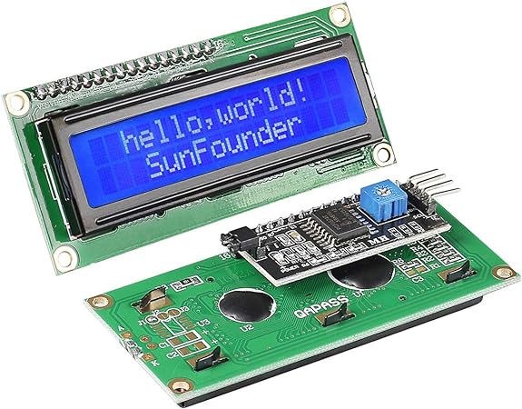
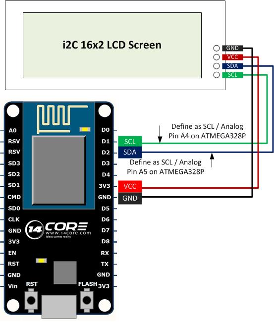

# ESP8266-Auto-Parking
Auto Parking implementation on ESP8266

## Technologies Used

- **ESP8266:** 📡   
    
- **LCD Module Display 16x2**  
    
- **Arduino:** 🤖
- **WiFi:** 📶
- **C++:** 🐦

## Connection Digram 

## Safety 

Protect your ESP32 and LCD from burning out with these steps! 🚀

### Steps 📝

1. **Power Supply Stability** ⚡:
   - Ensure a stable power supply for both ESP32 and LCD.
   - Use a voltage regulator for consistent voltage.

2. **Decoupling Capacitors** 🔗:
   - Place ceramic capacitors near power supply pins.
   - Stabilize voltage and filter out noise.

3. **Series Resistors** 🚧:
   - Add series resistors in data lines, especially for the LCD.
   - Limit current and protect from overcurrent situations.

4. **Backlight Protection** 💡:
   - Add a current-limiting resistor for the LCD backlight.
   - Verify correct voltage and current.

5. **Voltage Spike Protection** ⚠️:
   - Use TVS diodes for power and signal lines.
   - Add clamping diode for reverse voltage.

6. **Check Data Sheet** 📚:
   - Refer to LCD and ESP32 datasheets for specific requirements.
   
7. **Proper Grounding** ⚙️:
   - Ensure proper grounding for ESP32 and LCD.

8. **Fuse Protection** 🧨:
   - Add a fuse to protect against overcurrent.

9. **Testing** 🛠️:
   - Test incrementally, starting with minimal connections.

## Notes 📌
- Always refer to component datasheets for accurate information.
- Monitor for stability throughout the development process.

Feel free to customize these steps based on your specific components and requirements! Happy coding! 🚀

